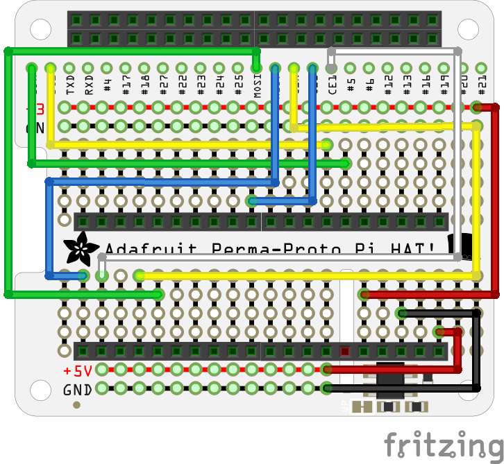

# Smart Plant Example for Pico W 🪴

Use [MicroPython](https://micropython.org) with a Raspberry Pi Pico W, [Pimoroni Grow Kit](https://shop.pimoroni.com/products/grow?variant=32208365486163), and [Twilio](https://www.twilio.com) to create a plant that texts you.

Please see the ["Give a plant a personality using the Raspberry Pi Pico W" guide on Hackster.io](https://www.hackster.io/sandeep-mistry/give-a-plant-a-personality-using-the-raspberry-pi-pico-w-23f701) for step by step setup instructions.

## Hardware

 * Raspberry Pi Pico W
 * [Pimoroni Grow Kit](https://shop.pimoroni.com/products/grow?variant=32208365486163)
 * [Adafruit Perma-Proto HAT for Pi Mini Kit - No EEPROM](https://www.adafruit.com/product/2310)

Wiring diagram to create adapter board to use Raspberry Pi Pico W board with [Pimoroni Grow HAT Mini](https://shop.pimoroni.com/products/grow-hat-mini?variant=32345076006995) board:

## License

[MIT](LICENSE)

---

Disclaimer: This is not an official Arm product.
